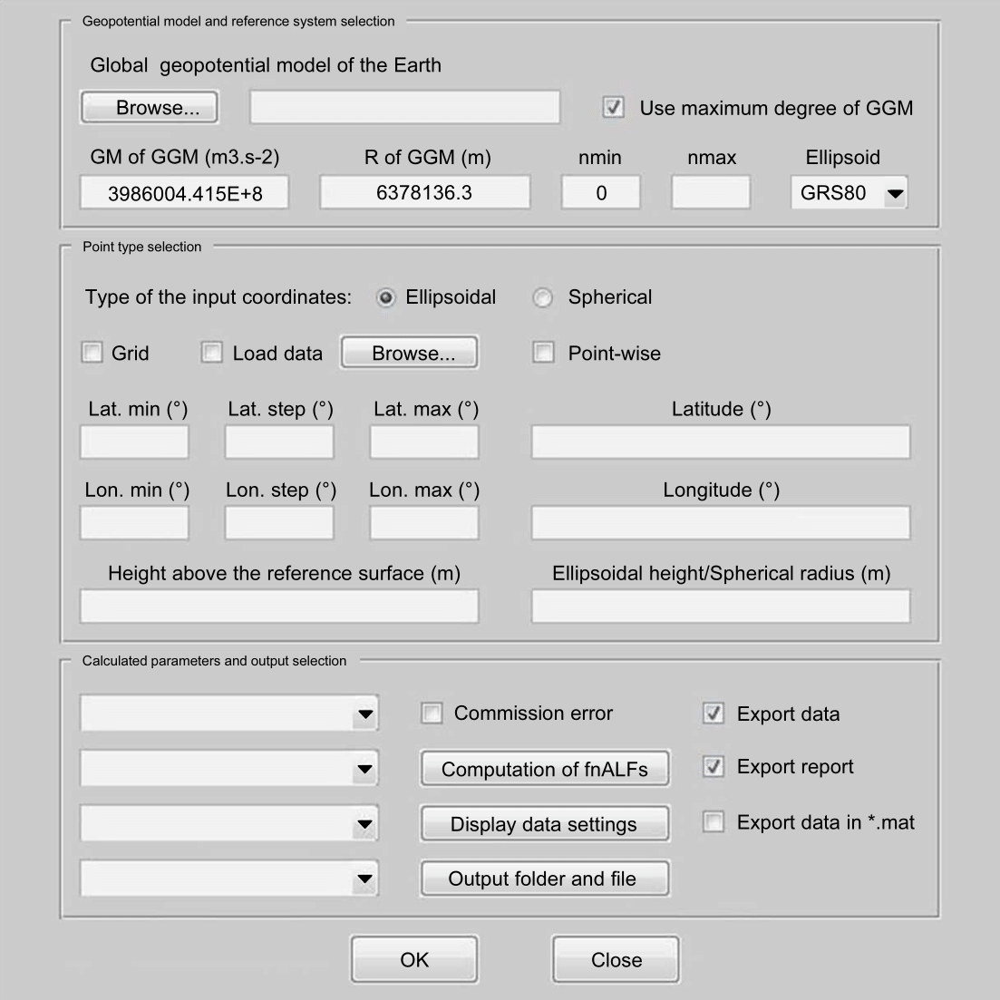

# GrafLab

GrafLab (GRAvity Field LABoratory) is a MATLAB-based routine to compute
functionals of the geopotential up to high degrees (tens of thousands and
beyond).

## Features:

* Evaluates 38 functionals of the geopotential (e.g., the geoid, height
  anomaly, gravity anomalies/disturbances, deflections of the vertical,
  gravitational tensor).

* Evaluates the commission error of 26 functionals using a full
  variance-covariance matrix of spherical harmonic coefficients.

* Supports efficient FFT-based synthesis at grids and point-by-point synthesis
  at scattered points.

* Reads models in the gfc format defined by ICGEM.

* Works with evaluation points defined by spherical as well as ellipsoidal
  coordinates.

* Plots output data on a map.

Users can interact with GrafLab either through a GUI (see below) or from the
command line.

Too see a few simple aplications of GrafLab, you may visit
[https://www.blazejbucha.com/#GrafLab](https://www.blazejbucha.com/#GrafLab).

# Documentation

If you want just a brief introduction to GrafLab, see
[docs/user-manual.txt](docs/user-manual.txt).

A detail GrafLab cookbook is available at
[https://github.com/blazej-bucha/graflab-cookbook](https://github.com/blazej-bucha/graflab-cookbook).

To go through the equations implemented in GrafLab, see
[docs/Definition_of_functionals_of_the_geopotential_used_in_GrafLab_software.pdf](docs/Definition_of_functionals_of_the_geopotential_used_in_GrafLab_software.pdf).

# Contributing

Contributions of any kind are welcome!

# Contact

Feel free to contact the author, Blazej Bucha, at blazej.bucha@stuba.sk.

# Citing

If you use GrafLab in your work, please consider citing our paper on GrafLab.

* Bucha, B., Janák, J., 2013. A MATLAB-based graphical user interface program
  for computing functionals of the geopotential up to ultra-high degrees and
  orders. Computers & Geosciences 56, 186-196,
  [https://doi.org/10.1016/j.cageo.2013.03.012](https://doi.org/10.1016/j.cageo.2013.03.012)

# Other related projects

* [CHarm](https://github.com/blazej-bucha/charm) -- C library for spherical
  harmonic transforms up to high degrees (tens of thousands and beyond).
  Supports OpenMP parallelization for shared memory architectures and
  vectorized CPU instructions (AVX, AVX2, AVX-512).

* [isGrafLab](https://github.com/blazej-bucha/isgraflab) (Irregular Surface
  GRAvity Field LABoratory) -- A modified version of GrafLab to perform
  accurate and fast synthesis of gravity field quantities at dense grids
  residing on irregular surfaces such as the Earth's surface.

# Disclaimer

GrafLab is an old project that breaks literally all of the best practices in
terms of coding and documenting standards. Nonetheless, the package seems to
work correctly, it has been thoroughly tested and the computation speed is
reasonable (as far as it is possible in MATLAB). Hoping it might still be
useful to others, GrafLab remains being publicly available.

